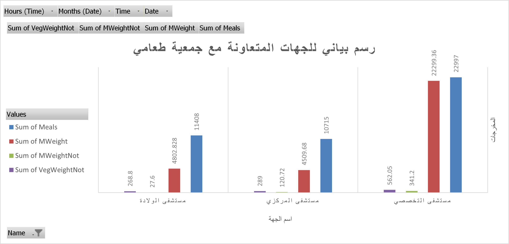

# 🍱 Taami Project -Data Analysis- Phase 1
This project analyzes real data from Taami (Food Preservation Charity) to identify trends in food donations, understand the causes of food waste, and provide actionable insights to help Taami improve food distribution, reduce waste, and ultimately increase its impact on community food security.
> Note: The original dataset used in this project contains real, anonymized data provided by Taami.
> For privacy reasons, only sample visual outputs are shared publicly in this repository.

---

## 📌 Project Overview
This project analyzes real data provided by **Taami (Food Preservation Charity)** to identify trends in food donations, understand the causes of food waste, and support better decision-making to enhance food management efficiency.

The primary goal of this project is to convert raw data from the charity into actionable insights to:
- Reduce food waste.
- Identify key donors with the highest rates of valid and invalid meals.
- Highlight days with unusual food waste patterns.
- Support the charity’s operational planning and decision-making.

This project is part of my data analysis learning journey and applies analytical skills to support social impact initiatives.

---

## 🚀 Phase 1: Completed Tasks

**Duration:** Aug – Oct 2025  
**Status:** ✅ Phase 1 Completed

### Goals of Phase 1
- ✅ Clean and prepare raw data from the charity’s records.
- ✅ Perform descriptive statistical analysis.
- ✅ Identify trends and outliers in food donations.
- ✅ Create initial data visualizations.
- ✅ Document the analysis process and findings.

### Achievements
- Cleaned and structured 101 days of real data.
- Calculated daily and weekly averages for valid vs. invalid food donations.
- Discovered top donors contributing the most valid meals.
- Identified specific days with unusually high food waste.
- Designed early visual charts to present results.

---

## ⚙️ Tools and Technologies

|         Tool        |               Purpose              |
|---------------------|------------------------------------|
|       **Excel**     | Data validation and cross-checking |
|     **GitHub**      | Version control and documentation  |
| **CSV/Excel files** |         Data source format         |

---

## 📊 Sample Visualization
Below is an example chart comparing valid and invalid food quantities over three months (101 Days).

**(This visualization demonstrates the overall food quality trend and identifies peak waste days.)**

---

## 🔮 Next Steps (Phase 2 -Final-)

- Build an **interactive dashboard** for monthly updates.  
- Automate **data imports and cleaning scripts**.  
- Enhance **visual storytelling** using Python and advanced libraries like Plotly or Seaborn. 
- Publish full project documentation and dashboards on GitHub Pages.
